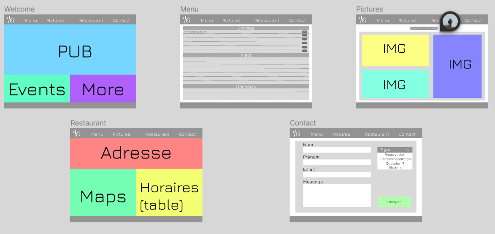

# restaurant-css-framework By Thomas Syben

Bienvenue sur mon projet de restaurant fictif. Vous trouverez sur le lien ci dessous mon projet réaliser durant toute cette semaine. J'ai principalement utilisé Bootstrap pour arriver à cette fin.

[Lien vers ma page](https://harbingar.github.io/error404/)

## Objectif

Me familiariser avec l'outil Bootstrap et son fonctionnement.
Produire un premier projet fictif static en dévellopement web.

## Localisation

Projet distribué et complété durant la formation BeCode de Junior Developper.
Octobre 2023 | Bruxelles - Belgique

## Maquette

Quelques images de la maquettes. 
Principalement réalisée pour visualiser un résultat qui mélange mon style et les requêtes demandées.

Potentiellement différent du rendu final.

## Progression

En cours - Corrections de bugs et ajouts de détails

## Contenu

5 sections :
- Welcome (page d'accueil)
- Menu (Page principale)
- Pictures (Page de photos des produits)
- Restaurant (Localité et horraires)
- Contact (Contact de différents types pour les clients)

Les 5 pages contiennent deux parties commune, le header ainsi que le footer qui intègrent le menu de navigation entre les pages ainsi que les mentions copyright et crédits d'auteurs.

#### Update

4 pages ont été ajoutés à la section gallerie pour séparés les différents produits du restaurants par types (entrées, plâts, desserts et boissons)

## Languages utilisés

- HTML5
- CSS
- Framework Bootstrap 

